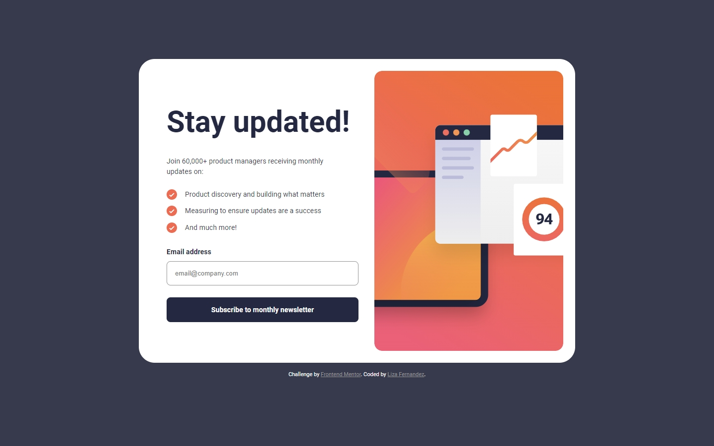

# Frontend Mentor - Newsletter sign-up form with success message solution

This is a solution to the [Newsletter sign-up form with success message challenge on Frontend Mentor](https://www.frontendmentor.io/challenges/newsletter-signup-form-with-success-message-3FC1AZbNrv). Frontend Mentor challenges help you improve your coding skills by building realistic projects.

## Table of contents

- [Overview](#overview)
  - [The challenge](#the-challenge)
  - [Screenshot](#screenshot)
  - [Links](#links)
- [My process](#my-process)
  - [Built with](#built-with)
  - [What I learned](#what-i-learned)
  - [Continued development](#continued-development)
  - [Useful resources](#useful-resources)
- [Author](#author)

## Overview

### The challenge

Users should be able to:

- Add their email and submit the form
- See a success message with their email after successfully submitting the form
- See form validation messages if:
  - The field is left empty
  - The email address is not formatted correctly
- View the optimal layout for the interface depending on their device's screen size
- See hover and focus states for all interactive elements on the page

### Screenshot

**Desktop Layout**



**Mobile Layout**


### Links

- Solution URL: [Add solution URL here](https://your-solution-url.com)
- Live Site URL: [https://newsletter-form-sign-up-lf.netlify.app/](https://newsletter-form-sign-up-lf.netlify.app/)

## My process

### Built with

- JavaScript
- Sass
- Semantic HTML5 markup
- Flexbox
- CSS Grid
- Mobile-first workflow
- BEM (Block, Element, Modifier)

### What I learned

#### Picture and Source HTML tags

I learned how to use the picture and source tags. With the source tag, I was able to have different sized header images for different breakpoints. This is a better approach compared to adding multiple img tags and hiding the different images depending on viewport width. This is because with source, only the images for the current viewport width is downloaded. With multiple img tags, each image would be downloaded regardless of viewport width. Therefore, by using source tags as opposed to img tags, users will use less data on mobile and better performance regardless of device.

```html
<header>
  <picture>
    <source
      media="(min-width: 1024px)"
      srcset="./assets/images/illustration-sign-up-desktop.svg"/>
    <source
      media="(min-width: 768px)"
      srcset="./assets/images/illustration-sign-up-tablet.svg"/>
    
</header>
```

#### Class States

I also learned to use a single class state on the body to display or hide content. For example, a single sucess state was added to the body. Using JavaScript, this state is added when the form is submitted. When present, all form content is hidden, and the success message, indicating that the form submission was successful, is displayed.

```css
/* When the body has the success state class, hide the main container
/* and display the success message. */

body {
  &.success-state-active {
    .container {
      display: none;
    }

    /* Override the default 'display: none' to show the message */
    .success-message {
      display: flex;
    }
  }
}
```

#### Form Validation

This project also allowed me to learn how to validate forms. To validate that the user has entered a valid email address, I used a regex (regular expression). Regex are patterns used to match character combinations in strings. In conjunction with the test() method, I was able to validate whether the email submitted by the user, has characters on either side of the @ symbol. If so, then the email entered by the user is valid.

```js
/** Function
/* Handles Validation. Checks if an email address has been entered by the user and
/* if so, whether it is a valid email with characters on either side of the @ symbol.
/* If either of the above rules are not true, then display an error message.
/* For users with assistive technology, sets aria-invalid attribute to true if an error
/* occurs.
/* @param {email} : The email address submitted through the form
**/

function validateEmail(email) {
  const isValidEmail = /^\S+@\S+$/g; // Regex
  if (!isValidEmail.test(email)) {
    emailInput.setAttribute("aria-invalid", "true");
    return "Valid email required";
  } else {
    emailInput.setAttribute("aria-invalid", "false");
    return "";
  }
}
```

### Continued development

For future projects, I would like to continue creating forms and improve my knowledge on form validation techniques. In particular, I would like to explore the use of third party object validation packages. I would also like to continue to utilise more JavaScript in my projects.

### Useful resources

[FreeCodeCamp Tutorial on Forms and Validation](https://www.freecodecamp.org/news/build-and-validate-beautiful-forms-with-vanilla-html-css-js/) - helpful tutorial on how to create a form and conduct client-side validation

## Author

- Website - [Liza Fernandez](https://www.lizafernandez.com)
- Frontend Mentor - [@aelvanna](https://www.frontendmentor.io/profile/aelvanna)
